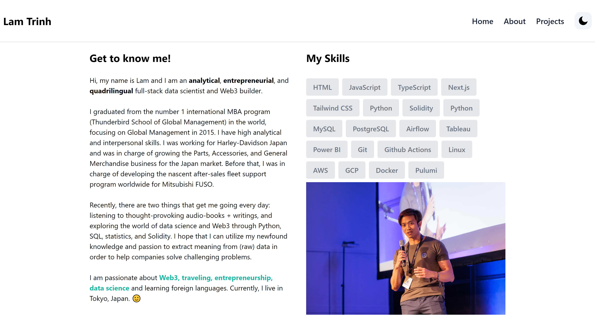

# Tailwind CSS and Next.js Portfolio

Welcome to the personal website of Lam Trinh. This website was created with Tailwind CSS and Next.js.

Below is what my website looks like. I hope you enjoy it!



## Notes
1. To create a new directory or path inside frotnend, create a new folder inside app/ folder. We have created the blog/foler. Every time we add a new .md file in the app/blog/posts folder, it will create a new page for us. We can use [slug].tsx to create a dynamic page.

## Running Locally

You can run the application in VS Code or a terminal and it will be available at `http://localhost:3000`.

```bash
npm install
npm run dev
```


### Notes
pages/ folder is not really used, so deleted it.
Created a new page in app/blog/blog.tsx
